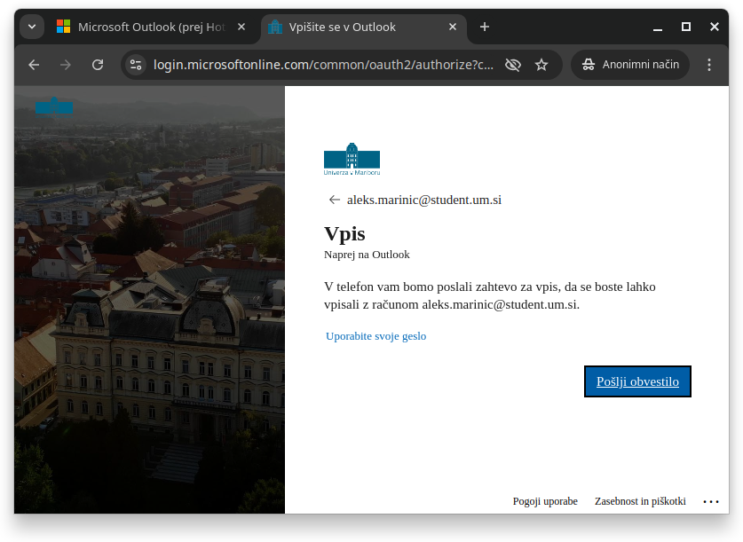

# Kako se prijaviti v Microsoft-ove storitve z @student.um.si ali @um.si

> Pomoč v "predčasno" prijavo in uporabo Microsoft-ovih storitev preko alternativne prijave (Microsoft Authenticator).

## Potrebne stvari

- obstoječa seja na mobilnem telefonu (npr.: Outlook)
- Android / iOS telefon

## Koraki za prijavo preko Microsoft Authenticator

1. Prenesite aplikacijo Microsoft Authenticator na mobilni telefon.
2. Odprite aplikacijo, pojdite skozi začetno nastavitev in dodalo Vam bo v telefon vpisane Microsoftove uporabniške račune (npr.: janez.novak@student.um.si).
3. Izberite svoj UM račun in nato "Vpis brez gesla", katerega boste omogočili. Postopek Vas bo peljal v spletni brskalnik na telefonu, kjer samo sledite Microsoft-ovim navodilom (precej preprosta in v slovenščini).
4. Dodajte možnost za vpis preko Microsoft Authenticator.
5. Po končani namestitvi pojdite nazaj v aplikacijo in tam ponovno potrdite "Vpis brez gesla" (včasih se noče omogočiti ob prvem poskusu).

## Uporaba prijave preko Microsoft Authenticator-ja

1. Odprite spletni portal https://outlook.com.
2. V zgornjem desnem kotu kliknite na gumb "Vpis".
3. Uporabi tvoj študentski/službeni e-poštni naslov (npr.: janez.novak@student.um.si).
4. Prikazalo se Vam bo obvestilo o morebitni prijavi preko poslane zahteve na mobilni telefon. Potrdi ga s pritiskom na gumb "Pošlji obvestilo".

5. Na telefonu se pojavi obvestilo o potrjevanju prijave. Klikni nanj.
6. V polje vnesi dvomestno število, katero se ti prikaže na zaslonu prijave (tam kjer ste prej kliknil na gumb "Pošlji obvestilo").
7. Uspešno ste se prijavili v Microsoft-ov spletni portal.
